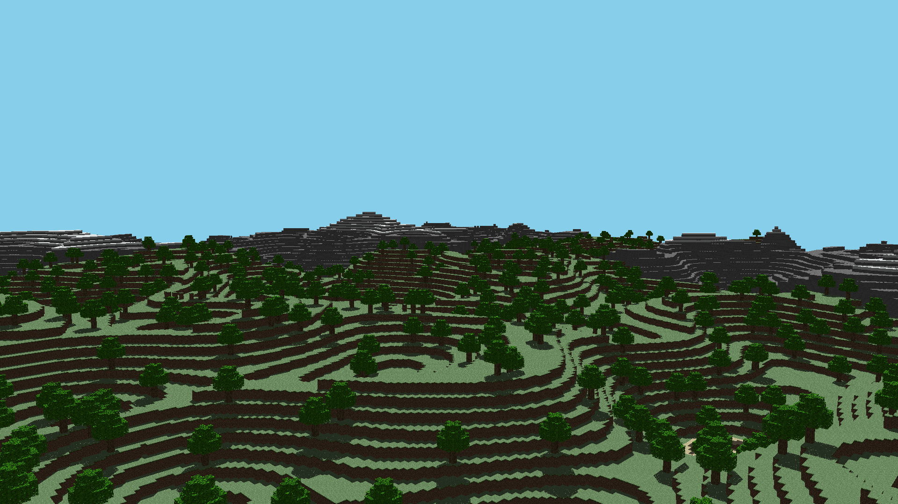

# C++ Minecraft Terrain Renderer

> A custom C++ voxel engine built from scratch using Ray Tracing and Digital Differential Analyzer (DDA) algorithms for procedural terrain generation.

**Made by Axel Thauvin and Johan Emmanuelli**

---

## Overview

This project is a CPU-based rendering engine designed to generate voxel environments.



## Features

* **Procedural Generation**: The engine uses Perlin Noise and Fractal Brownian Motion (FBM) to create realistic and varied terrain features such as hills, valleys, and water lakes.
* **DDA Ray Tracing**: Implements the Digital Differential Analyzer algorithm for fast and efficient ray traversal through dense 3D voxel grids.
* **Stoken Textures (oops)**: Integrates decompiled block textures directly from Minecraft 1.21.1
* **Multi-threading**: Using OpenMP to distribute ray calculations across multiple CPU cores.

---

## Installation and Usage


### Build

To compile the source code and prepare the test environment, run the following command in the project root:

```bash
make test
```

### Run

Once compiled, execute the generated binary to initiate the rendering process:

```bash
./test
```